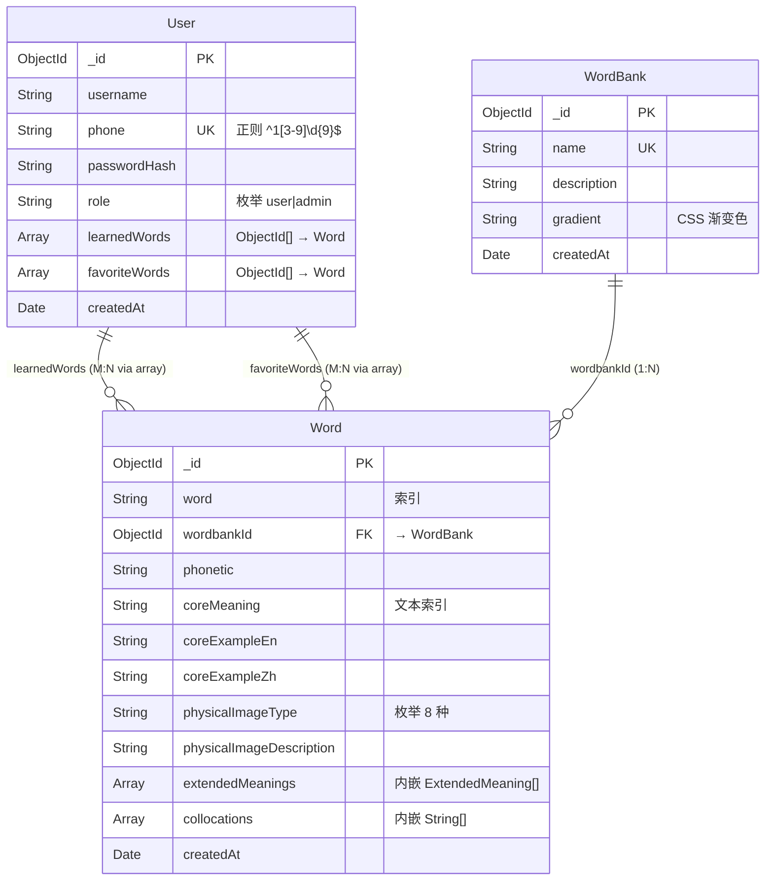

# 英语母语者词典 — 数据库 Schema 设计

| 属性 | 值 |
|------|-----|
| 版本 | v1.0 |
| 创建日期 | 2026-07-07 |
| 关联 PRD | [PRD v1.0](./prd/prd.md) |
| 关联 ADR | [后端 ADR v1.0](./adr/server.md) |
| 数据库 | MongoDB Atlas（云托管） |
| ODM | Mongoose |
| 语言/框架 | Node.js + Express + TypeScript |

---

## 第 1 章：概述

### 1.1 数据库选型

基于 [后端 ADR §3.2](./adr/server.md) 的技术决策，本项目选用 **MongoDB Atlas**（云托管）作为数据库，**Mongoose** 作为 ODM 层。

选型理由：
- 词典数据天然为**文档结构**：单词（Word）内嵌引申义数组（ExtendedMeaning[]）和搭配数组（Collocation[]），与 MongoDB 嵌套文档模型一一对应
- Schema 灵活：8 种物理意象类型（physicalImageType）后续可扩展，无需 ALTER TABLE
- 云托管免运维：MongoDB Atlas 免费层 512MB 对初期数据量充足
- 与前端 JSON 结构一致：前端 Taro/React 组件直接消费 MongoDB 文档的 JSON 表示，无需 JOIN 拼装

### 1.2 嵌套文档设计思路

本项目的核心实体 **Word** 包含两个内嵌子结构：

| 子结构 | 关系 | 内嵌原因 |
|--------|------|---------|
| ExtendedMeaning（引申义） | Word 1:N ExtendedMeaning | 引申义与单词强绑定，不会跨单词共享，查询单词时总是一同展示 |
| Collocation（搭配） | Word 1:N Collocation | 搭配为简单字符串数组，无独立查询需求，内嵌避免额外 JOIN |

> **引用 vs 内嵌区分**：`wordbankId` 采用**引用**（指向 WordBank 集合），因为词库是独立实体，需要独立 CRUD；`extendedMeanings` 和 `collocations` 采用**内嵌**，因为它们只在单词详情的上下文中出现，无需独立查询。

集合间引用关系概览：

```
users ────── learnedWords: [ObjectId] ──────► words
  │                                              │
  └── favoriteWords: [ObjectId] ────────────────┘
                                                 │
                                           wordbankId: ObjectId
                                                 │
                                                 ▼
                                            wordbanks
```

---

## 第 2 章：ER 关系图



> **说明**：
> - `extendedMeanings` 和 `collocations` 是 Word 的**内嵌子文档/数组**，非独立集合，因此在 ER 图中未作为独立实体出现。其结构详情见 §3.4。
> - `learnedWords` 和 `favoriteWords` 是 User 中的 ObjectId 数组，实现 User 与 Word 的多对多关联（M:N 的简化实现）。
> - Mermaid `erDiagram` 对 MongoDB 嵌套文档支持有限，内嵌关系以注释补充说明。

---

## 第 3 章：集合详细设计

### 3.1 users 集合

用户信息存储，包含认证凭据、角色权限、学习记录和收藏。

| 字段名 | 类型 | 必填 | 默认值 | 索引 | 说明 |
|--------|------|------|--------|------|------|
| `_id` | ObjectId | 是 | 自动 | PK | MongoDB 自动生成的主键 |
| `username` | String | 是 | — | — | 用户名（昵称），注册时必填 |
| `phone` | String | 是 | — | **unique** | 手机号，格式校验正则 `^1[3-9]\d{9}$`，用于登录 |
| `passwordHash` | String | 是 | — | — | bcrypt（10 rounds salt）加密后的密码哈希 |
| `role` | String | 是 | `'user'` | — | 用户角色，枚举 `'user'` \| `'admin'` |
| `learnedWords` | [ObjectId] | 否 | `[]` | — | 已学单词 ID 列表，引用 Word 集合 |
| `favoriteWords` | [ObjectId] | 否 | `[]` | — | 收藏单词 ID 列表，引用 Word 集合 |
| `createdAt` | Date | 是 | `Date.now` | — | 账号创建时间（Mongoose timestamps） |

**Mongoose Schema 示例**：

```typescript
const UserSchema = new Schema({
  username:      { type: String, required: true },
  phone:         { type: String, required: true, unique: true, match: /^1[3-9]\d{9}$/ },
  passwordHash:  { type: String, required: true },
  role:          { type: String, required: true, enum: ['user', 'admin'], default: 'user' },
  learnedWords:  [{ type: Schema.Types.ObjectId, ref: 'Word' }],
  favoriteWords: [{ type: Schema.Types.ObjectId, ref: 'Word' }],
}, { timestamps: true });  // timestamps 自动管理 createdAt / updatedAt
```

---

### 3.2 wordbanks 集合

词库信息存储，每个词库有独立的名称、描述和视觉标识（渐变色）。

| 字段名 | 类型 | 必填 | 默认值 | 索引 | 说明 |
|--------|------|------|--------|------|------|
| `_id` | ObjectId | 是 | 自动 | PK | MongoDB 自动生成的主键 |
| `name` | String | 是 | — | **unique** | 词库名称（如"基础高频"、"商务英语"） |
| `description` | String | 是 | — | — | 词库描述文本 |
| `gradient` | String | 否 | `"linear-gradient(135deg, #667eea 0%, #764ba2 100%)"` | — | CSS 渐变色字符串，用于前端词库卡片背景 |
| `createdAt` | Date | 是 | `Date.now` | — | 创建时间（Mongoose timestamps） |

**Mongoose Schema 示例**：

```typescript
const WordBankSchema = new Schema({
  name:        { type: String, required: true, unique: true },
  description: { type: String, required: true },
  gradient:    { type: String, default: 'linear-gradient(135deg, #667eea 0%, #764ba2 100%)' },
}, { timestamps: true });
```

---

### 3.3 words 集合

单词是核心实体，包含词汇基本信息、核心义、物理意象、引申义链和搭配。

| 字段名 | 类型 | 必填 | 默认值 | 索引 | 说明 |
|--------|------|------|--------|------|------|
| `_id` | ObjectId | 是 | 自动 | PK | MongoDB 自动生成的主键 |
| `word` | String | 是 | — | **normal** | 单词名（如 "flow"、"grasp"），用于搜索 |
| `wordbankId` | ObjectId | 是 | — | **normal** | 所属词库，引用 WordBank 集合 |
| `phonetic` | String | 否 | — | — | 音标（如 `/floʊ/`） |
| `coreMeaning` | String | 是 | — | **text** | 核心义描述（如"沿阻力最小路径持续运动"） |
| `coreExampleEn` | String | 是 | — | — | 核心义英文例句 |
| `coreExampleZh` | String | 是 | — | — | 核心义中文翻译 |
| `physicalImageType` | String | 是 | — | — | 物理意象类型，枚举 8 种（见 §4 约束汇总） |
| `physicalImageDescription` | String | 是 | — | — | 物理意象描述（如"液体沿最小阻力路径持续流动"） |
| `extendedMeanings` | [SubDocument] | 否 | `[]` | — | 引申义子文档数组，结构见 §3.4 |
| `collocations` | [String] | 否 | `[]` | — | 常见搭配字符串数组（如 `["flow rate", "go with the flow"]`） |
| `createdAt` | Date | 是 | `Date.now` | — | 创建时间（Mongoose timestamps） |

**Mongoose Schema 示例**：

```typescript
const WordSchema = new Schema({
  word:                     { type: String, required: true, index: true },
  wordbankId:               { type: Schema.Types.ObjectId, ref: 'WordBank', required: true, index: true },
  phonetic:                 { type: String },
  coreMeaning:              { type: String, required: true },
  coreExampleEn:            { type: String, required: true },
  coreExampleZh:            { type: String, required: true },
  physicalImageType:        { type: String, required: true, enum: PHYSICAL_IMAGE_TYPES },
  physicalImageDescription: { type: String, required: true },
  extendedMeanings:         [ExtendedMeaningSchema],   // 内嵌子文档
  collocations:             [{ type: String }],         // 内嵌字符串数组
}, { timestamps: true });

WordSchema.index({ coreMeaning: 'text' });  // MongoDB 全文索引
```

---

### 3.4 extendedMeanings 子文档（内嵌于 Word）

引申义是 Word 的内嵌子文档，每个单词可有 0 到多个引申义。每个引申义记录从物理义到引申义的逻辑演化路径。

| 字段名 | 类型 | 必填 | 默认值 | 说明 |
|--------|------|------|--------|------|
| `evolutionDescription` | String | 是 | — | 逻辑演化描述，从物理义到引申义的认知路径（如"流体沿固定方向持续流动 → 思想/语言的连贯状态"） |
| `meaning` | String | 是 | — | 引申义（如"（思想/语言）连贯流畅"） |
| `partOfSpeech` | String | 是 | — | 词性，枚举 `'noun'` \| `'verb'` \| `'adj'` \| `'adv'` \| `'prep'` \| `'conj'` \| `'pron'` \| `'other'` |
| `exampleEn` | String | 是 | — | 英文例句 |
| `exampleZh` | String | 是 | — | 中文翻译 |

**Mongoose SubDocument Schema 示例**：

```typescript
const ExtendedMeaningSchema = new Schema({
  evolutionDescription: { type: String, required: true },
  meaning:              { type: String, required: true },
  partOfSpeech:         { type: String, required: true, enum: ['noun', 'verb', 'adj', 'adv', 'prep', 'conj', 'pron', 'other'] },
  exampleEn:            { type: String, required: true },
  exampleZh:            { type: String, required: true },
}, { _id: true });  // _id: true 为每个引申义生成独立 ID，方便前端精确定位
```

> **注意**：ExtendedMeaning 不设独立集合，始终作为 Word.extendedMeanings 的内嵌子文档存在。Mongoose 中通过 `[ExtendedMeaningSchema]` 语法定义子文档数组。

---

### 3.5 收藏与学习记录

基于 [后端 ADR §6.1](./adr/server.md) 数据模型设计和 [PRD §9.3](./prd/prd.md) 后续版本规划，收藏和学习记录的数据模型设计如下：

#### 3.5.1 收藏功能（User.favoriteWords）

- **实现方式**：在 User 模型中增加 `favoriteWords: [ObjectId]` 字段（见 §3.1 users 表），引用 Word 集合
- **无需独立集合**：收藏是 User-Word 的多对多关联，`ObjectId[]` 足以表达
- **查询场景**：
  - 查询用户收藏列表：`Word.find({ _id: { $in: user.favoriteWords } })`
  - 判断是否已收藏：`user.favoriteWords.includes(wordId)`
  - 收藏/取消收藏：`$addToSet` / `$pull` 原子操作

#### 3.5.2 学习记录（User.learnedWords）

- **实现方式**：复用 `User.learnedWords: [ObjectId]` 字段（见 §3.1 users 表），记录已学单词 ID 列表
- **查询场景**：
  - 已学单词数：`user.learnedWords.length`
  - 已学单词列表：`Word.find({ _id: { $in: user.learnedWords } })`
  - 标记已学：`User.findByIdAndUpdate(userId, { $addToSet: { learnedWords: wordId } })`
- **扩展预留**：如需记录学习日期、学习次数等详情，后续可扩展为独立 `learning_records` 集合：
  ```typescript
  // 未来扩展（当前版本不实现）
  {
    userId:    ObjectId,   // → User
    wordId:    ObjectId,   // → Word
    learnedAt: Date,       // 学习时间
    reviewCount: Number,   // 复习次数
    lastReviewedAt: Date,  // 最近复习时间
  }
  ```

---

## 第 4 章：约束与枚举汇总

| 约束类型 | 字段 | 定义 |
|----------|------|------|
| 角色枚举 | `User.role` | `'user'` \| `'admin'` |
| 物理意象枚举 | `Word.physicalImageType` | `'flow'` \| `'grasp'` \| `'break'` \| `'bear'` \| `'drive'` \| `'light'` \| `'leverage'` \| `'yield'` |
| 词性枚举 | `ExtendedMeaning.partOfSpeech` | `'noun'` \| `'verb'` \| `'adj'` \| `'adv'` \| `'prep'` \| `'conj'` \| `'pron'` \| `'other'` |
| 手机号格式 | `User.phone` | 正则 `^1[3-9]\d{9}$`（11 位中国大陆手机号） |
| 唯一约束 | `User.phone` | unique index — 手机号不可重复注册 |
| 唯一约束 | `WordBank.name` | unique index — 词库名不可重复 |
| 必填约束 | 见各集合字段表 `必填` 列 | `required: true` 的字段在 Mongoose 层强制校验 |
| 引用完整性 | `Word.wordbankId` | 引用 WordBank，删除词库前需检查关联单词（或通过 Mongoose hooks 处理） |
| 引用完整性 | `User.learnedWords` / `User.favoriteWords` | 引用 Word，数组中保留不存在的 ID 不影响查询（MongoDB 无外键强制约束） |

---

## 第 5 章：索引策略汇总

| 集合 | 字段 | 索引类型 | 用途 | 背景 |
|------|------|----------|------|------|
| `users` | `phone` | unique | 登录查询（按手机号查找用户）、注册去重 | 高频：每次登录/注册必查 |
| `wordbanks` | `name` | unique | 词库名去重、按名称查找词库 | 中频：管理后台 CRUD |
| `words` | `word` | normal | 按单词名精确搜索 | 高频：首页搜索、管理后台搜索 |
| `words` | `wordbankId` | normal | 按词库查询单词列表 | 高频：词库详情页 `GET /wordbanks/:id/words` |
| `words` | `coreMeaning` | text (MongoDB) | 全文搜索核心义描述 | 中频：搜索时匹配核心义中文描述 |

> **索引策略说明**：
> - `phone` 和 `name` 使用 **unique** 索引，同时满足查询加速 + 数据完整性双重需求
> - `word` 和 `wordbankId` 使用 **normal** 索引，加速等值查询和排序
> - `coreMeaning` 使用 MongoDB **text** 索引，支持中文全文搜索（如搜索"流动"匹配核心义描述中包含"流动"的单词）
> - MongoDB 默认对 `_id` 字段自动创建唯一索引，无需手动声明
> - 当前阶段无需复合索引，后续若出现"按词库搜索单词名"的高频场景，可增加 `{ wordbankId: 1, word: 1 }` 复合索引

---

## 第 6 章：命名规范

本项目的 MongoDB 集合与字段命名遵循以下规范，确保与 Mongoose/JavaScript 生态一致：

### 6.1 集合命名

| 规范 | 示例 |
|------|------|
| 小写复数形式 | `users`、`wordbanks`、`words` |
| 多词组合用驼峰或全小写拼接 | 当前均为单词，无需拼接 |
| 与 RESTful 路由一致 | `/api/v1/users` ↔ `users` 集合 |

### 6.2 字段命名

| 规范 | 正确示例 | 错误示例 |
|------|---------|---------|
| **camelCase**（统一使用） | `wordbankId`、`coreMeaning`、`physicalImageType` | ~~`wordbank_id`~~、~~`core_meaning`~~ |
| 引用字段以 `Id` 结尾 | `wordbankId` | ~~`wordbank`~~（不含引用对象） |
| 数组字段用复数 | `extendedMeanings`、`collocations`、`learnedWords`、`favoriteWords` | ~~`extendedMeaning`~~（数组应用复数） |
| 日期字段以 `At` 结尾 | `createdAt` | ~~`created`~~、~~`create_time`~~ |
| 布尔字段以 `is`/`has` 开头 | （当前 Schema 中无布尔字段） | — |
| 全拼写，拒绝缩写 | `description`、`phonetic` | ~~`desc`~~、~~`ph`~~ |

### 6.3 枚举值命名

| 规范 | 示例 |
|------|------|
| 枚举值使用小写字符串 | `'user'`、`'admin'`、`'flow'`、`'grasp'`、`'noun'`、`'verb'` |

---

## 附录 A：完整 Schema 类型定义（TypeScript）

以下 TypeScript 接口定义用于前后端类型共享（参考 [后端 ADR §3.1](./adr/server.md) 的"全栈 TypeScript"决策）：

```typescript
// === 枚举类型 ===

type UserRole = 'user' | 'admin';

type PhysicalImageType =
  | 'flow'
  | 'grasp'
  | 'break'
  | 'bear'
  | 'drive'
  | 'light'
  | 'leverage'
  | 'yield';

type PartOfSpeech =
  | 'noun'
  | 'verb'
  | 'adj'
  | 'adv'
  | 'prep'
  | 'conj'
  | 'pron'
  | 'other';

// === 实体接口 ===

interface IUser {
  _id: string;
  username: string;
  phone: string;
  passwordHash: string;
  role: UserRole;
  learnedWords: string[];   // ObjectId[] → IWord
  favoriteWords: string[];  // ObjectId[] → IWord
  createdAt: Date;
}

interface IWordBank {
  _id: string;
  name: string;
  description: string;
  gradient: string;
  createdAt: Date;
}

interface IExtendedMeaning {
  _id: string;
  evolutionDescription: string;
  meaning: string;
  partOfSpeech: PartOfSpeech;
  exampleEn: string;
  exampleZh: string;
}

interface IWord {
  _id: string;
  word: string;
  wordbankId: string;          // ObjectId → IWordBank
  phonetic?: string;
  coreMeaning: string;
  coreExampleEn: string;
  coreExampleZh: string;
  physicalImageType: PhysicalImageType;
  physicalImageDescription: string;
  extendedMeanings: IExtendedMeaning[];
  collocations: string[];
  createdAt: Date;
}
```

---

> **文档说明**：本文档为数据库 Schema **设计文档**，面向开发者评审和后续实施参考。实际的 Mongoose Model 代码（`server/src/models/*.ts`）将在 **Task 1.2（ORM 模型定义）** 中实现，届时将严格遵循本文档的字段定义、类型约束和索引策略。
